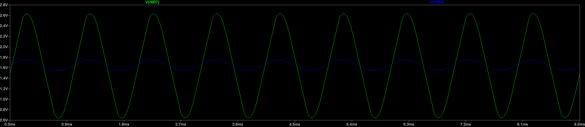
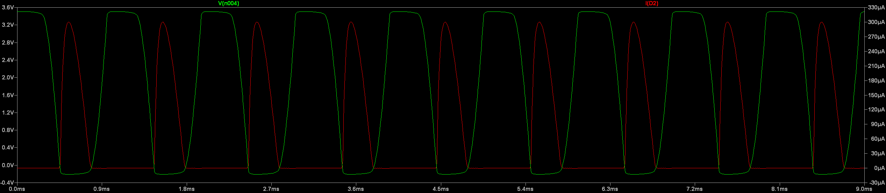
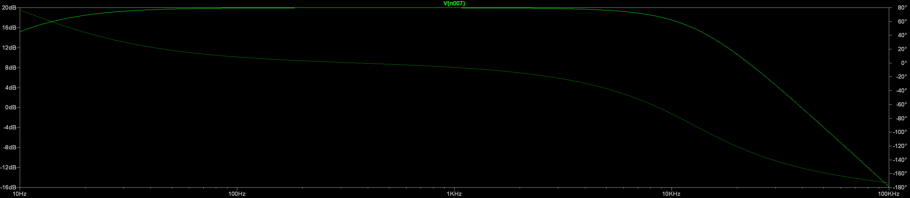
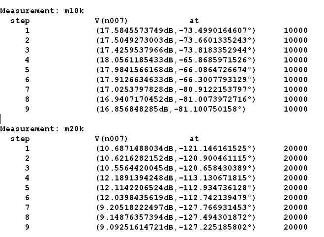

# Analog Front-End (AFE)


## Overview

The analog front-end (AFE) conditions the incoming analog signal before it is sampled by the ESP32 ADC.

The AFE provides:

- AC coupling
- Input protection
- Adjustable gain of 1x, 10x, and 100x
- 1.65 V DC biasing for single-supply operation
- Output low pass filter


## AFE Architecture

The AFE consists of the following stages:

```
Input
  ↓
AC Coupling
  ↓
Input Protection
  ↓
adjustable Gain
  ↓
Output Low-Pass Filter
  ↓
ADC

```


## Input Stage

### AC Coupling

A 10 nF capacitor is used at the AFE input to provide AC coupling.

The capacitor blocks the DC component of the incoming signal while allowing the target AC signal to pass to the amplifier stage.

The input is biased around 1.65 V to allow the AFE to operate from a single 3.3 V supply.

### Input Protection

An input protection network is implemented after the AC-coupling capacitor to protect the amplifier from excessive fault voltages.

The protection network consists of:

- A 2.2 kΩ current-limiting resistor
- BAT54 Schottky diodes
- The 1.65 V VBIAS reference

The resistor limits the current through the protection diodes during a fault condition.

Under a simulated 5 V fault condition, the current through the protection network was approximately 300 µA.

## VBIAS Generation

The AFE operates from a single 3.3 V supply. Therefore, the input signal must be biased around a suitable DC operating point.

A 1.65 V VBIAS reference is generated using a resistor divider:

$$
V_{BIAS} = 3.3\ V \times \frac{10\ k\Omega}{10\ k\Omega+10\ k\Omega} = 1.65\ V
$$

The generated VBIAS is buffered using an MCP6022 voltage follower before being distributed to the AFE.

Buffering the reference prevents the resistor divider from being significantly affected by the amplifier and other connected stages.

## Adjustable Gain Stage

The main amplification stage uses a non-inverting amplifier configuration based on the MCP6022.

Three selectable closed-loop gain settings are provided:

* 1×
* 10×
* 100×

The closed-loop gain is determined by:

$$
A_v = 1+\frac{R_f}{R_g}
$$

where:

$$
R_g=1\ k\Omega
$$

The selected feedback resistors are:

| Gain | $R_f$ | $R_g$ | Theoretical Gain |
| ---: | ----: | ----: | ---------------: |
|   1× |   0 Ω |  1 kΩ |                1 |
|  10× |  9 kΩ |  1 kΩ |               10 |
| 100× | 99 kΩ |  1 kΩ |              100 |

The gain stage is AC-coupled through a 22 µF capacitor in the lower feedback network.

Together with the 1 kΩ resistor, the capacitor establishes a high-pass response with a cutoff frequency of approximately:

$$
f_c =
\frac{1}{2\pi(1\ k\Omega)(22\ \mu F)}
\approx 7.2\ Hz
$$

This places the cutoff frequency below the specified lower signal frequency of 10 Hz.

## Output Low-Pass Filter

A second-order passive LC low-pass filter is implemented at the AFE output.

The filter consists of:

- 4.3 Ω series damping resistor
- 22 µH series inductor
- 4.7 µF shunt capacitor

The filter attenuates higher-frequency components before the signal is passed to the ADC.

### Damping

The 4.3 Ω series resistor provides damping for the LC network and reduces excessive resonant peaking.

Several damping resistance values were evaluated using LTspice. Increasing the resistance reduced the resonance peak but also increased attenuation near the upper end of the target frequency range.

A value of 4.3 Ω was therefore retained as a compromise between damping and preservation of the high-frequency response.

## AFE Design Summary

| Parameter                 |   Selected Value |
| ------------------------- | ---------------: |
| Supply voltage            |            3.3 V |
| VBIAS                     |           1.65 V |
| Input coupling capacitor  |            10 nF |
| Input protection resistor |           2.2 kΩ |
| Gain settings             |  1× / 10× / 100× |
| Gain feedback resistor    | 0 / 9 kΩ / 99 kΩ |
| Gain-stage capacitor      |            22 µF |
| Output damping resistor   |            4.3 Ω |
| Output inductor           |            22 µH |
| Output capacitor          |           4.7 µF |


## Simulation and Verification

The AFE was simulated in LTspice to verify its key electrical characteristics before proceeding to the ADC interface design.

The verification covers:

- Gain settings
- DC bias
- Input protection
- Maximum input range
- Frequency response
- Component tolerance

### Gain Verification

The adjustable gain stage was simulated for all three gain settings.

Theoretical closed-loop gains are:

| Gain Setting | Theoretical Gain | Theoretical Gain (dB) |
| ------------: | ---------------: | --------------------: |
| 1×            | 1                | 0 dB                  |
| 10×           | 10               | 20 dB                 |
| 100×          | 100              | 40 dB                 |

The simulated mid-band frequency responses are consistent with the expected gain settings.



### VBIAS Verification

The VBIAS reference was simulated to verify the operating point of the AFE.

The target bias voltage is:

$$
V_{BIAS}=1.65\ V
$$

The simulated AFE stages maintain a bias voltage of approximately 1.65 V under the tested gain configurations.

### Input Protection Verification

The input protection network was evaluated under a simulated 5 V fault condition. The protection network consists of the 2.2 kΩ current-limiting resistor and BAT54 Schottky diodes.

The simulated current through the protection network was approximately:

$$
I_{fault}\approx300\ \mu A
$$

And the voltage on the positive node of the opamp were limited around -0.2 V to 3.5 V.

This confirms that the current-limiting resistor significantly limits the fault current before it reaches the amplifier input.




### Frequency Response

The AFE frequency response was simulated over a wide frequency range to evaluate the behaviour of the input high-pass response and output low-pass filter.

The target signal band is:

$$
10\ Hz \leq f \leq 10\ kHz
$$

The output LC filter uses:

- \(R_9=4.3\ \Omega\)
- \(L=22\ \mu H\)
- \(C=4.7\ \mu F\)

The selected 4.3 Ω damping resistor provides a compromise between reducing LC resonance and preserving signal transmission near the upper end of the target frequency range.

A small resonant peak is present around 6 kHz in the 100× gain configuration. The peak is approximately 2 dB above the mid-band response.

Higher damping resistance values were evaluated during the design process. Although larger resistance values reduced the resonant peak, they also introduced additional attenuation near 10 kHz. Since the AFE is intended for signal detection and conditioning rather than precision amplitude measurement, the 4.3 Ω value was retained.



### Component Tolerance Analysis

Component tolerances were evaluated using LTspice to assess their effect on the AFE frequency response.

The assumed component tolerances are:

| Component Type | Tolerance |
| -------------- | --------: |
| Resistors      | ±1%       |
| Capacitors     | ±10%      |
| Inductor       | ±20%      |

The tolerance analysis was performed by sweeping the component values within their specified tolerance ranges.

The resulting frequency responses were compared at key frequencies, particularly 10 kHz and 20 kHz, to evaluate the variation introduced by component tolerances.



## Final AFE Parameters

| Parameter | Final Value |
| --------- | ----------: |
| Supply Voltage | 3.3 V |
| VBIAS | 1.65 V |
| Input Signal Range | 10 Hz – 10 kHz |
| Maximum Input | 1.45 V |
| Gain Settings | 1× / 10× / 100× |
| Input Coupling Capacitor | 10 nF |
| Input Protection Resistor | 2.2 kΩ |
| Gain-Stage Capacitor | 22 µF |
| Output Damping Resistor | 4.3 Ω |
| Output Inductor | 22 µH |
| Output Capacitor | 4.7 µF |

## Design Status

The AFE schematic and LTspice simulations have been completed.

The AFE has been verified for gain, biasing, input protection, maximum input conditions, frequency response, and component tolerance.

The next stage of the project is the design of the ESP32 ADC interface.


